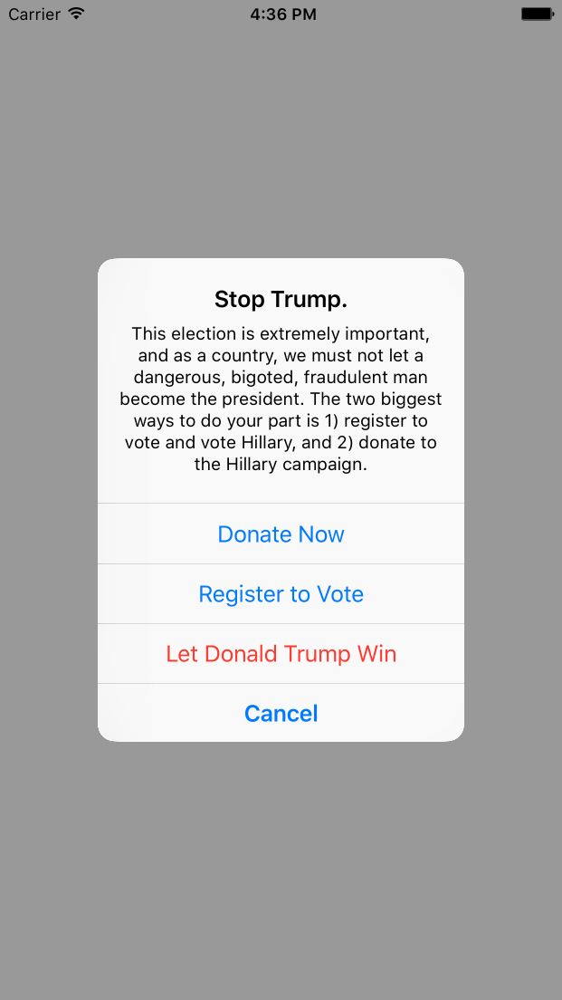

# ImWithHer

[](https://travis-ci.org/canzhiye/ImWithHer)
[](http://cocoapods.org/pods/ImWithHer)
[](http://cocoapods.org/pods/ImWithHer)
[](http://cocoapods.org/pods/ImWithHer)

## Why?

The 2016 presidential election is extremely important, and as a country, we must not let a dangerous, bigoted, fraudulent man become the president. The two biggest ways to do your part is 1) [register to vote](https://vote.usa.gov/) and vote Hillary, and 2) [donate](https://www.hillaryclinton.com/donate/?ref=ImWithHerPod) to the Hillary campaign.

## How does this work?

You're on GitHub reading this right now, so you probably build software. Have an iOS app? Want to do your part in making sure Donald Trump doesn't win? This prompt allows you to prompt your users to donate to Hillary with at most 3 lines of code. 



In your `application:didFinishLaunchingWithOptions:` function, add the following line of code.

```
ImWithHer.appLaunched()
```

Optionally, set how many days after the user first launches your app that you want to prompt them. (Default 0)
```
ImWithHer.daysUntilPrompt = 2
```

Optionally, set how many times a user must open your app before you prompt them. (Default 0)
```
ImWithHer.usesUntilPrompt = 2
```

## Installation

ImWithHer is available through [CocoaPods](http://cocoapods.org). To install
it, simply add the following line to your Podfile:

```ruby
pod "ImWithHer"
```

## Example

To run the example project, clone the repo, and run `pod install` from the Example directory first.

## Author

canzhiye, canzhiye@gmail.com

## License

ImWithHer is available under the MIT license. See the LICENSE file for more info.
